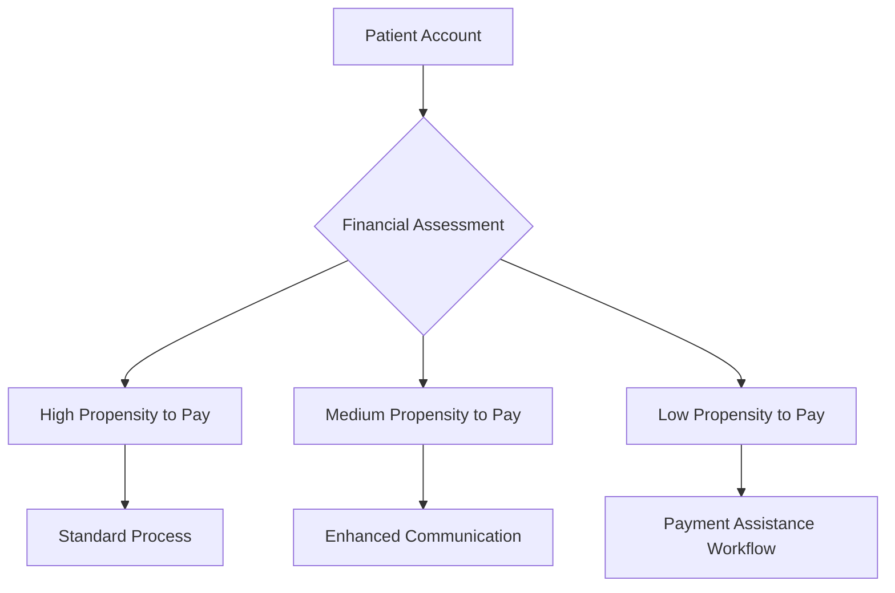

# MediCollect Pro

<div align="center">
  
  # 💵 MediCollect Pro 💵

  ### Turning unpaid balances into steady cash flow
  
  [](https://opensource.org/licenses/MIT)
  [](https://github.com/yourusername/medicollectpro)
  [](https://github.com/yourusername/medicollectpro)
  [](https://github.com/yourusername/medicollectpro)
  
</div>

## 💰 About MediCollect Pro

MediCollect Pro is a comprehensive patient payment collection platform designed to transform how healthcare practices manage their revenue cycle. By combining cutting-edge technology with behavioral economics principles, our solution dramatically improves collection rates while enhancing the patient financial experience.

🔗 [Official Website](https://www.medicollectpro.com)

---

## ✨ Key Benefits

### 📈 For Healthcare Practices

- **Increased Cash Flow** - Accelerate payments and reduce days in A/R by up to 43%
- **Reduced Administrative Burden** - Automate 90% of payment collection tasks
- **Higher Collection Rates** - Improve overall collection rates by 15-25%
- **Decreased Bad Debt** - Reduce write-offs by implementing proactive payment plans
- **EMR/EHR Integration** - Seamless connection to 12+ major healthcare systems

### 👨‍👩‍👧‍👦 For Patients

- **Flexible Payment Options** - Multiple ways to pay including credit card, ACH, digital wallets
- **Personalized Payment Plans** - Customized solutions based on financial situation
- **Financial Hardship Programs** - Built-in workflows for financial assistance
- **Transparent Billing** - Clear explanation of charges and payment expectations
- **Multi-Channel Communication** - Choose text, email, or traditional mail for notifications

---

## 💡 Behavioral Economics Integration

MediCollect Pro stands apart by incorporating proven behavioral economics principles:

1. **Smart Timing** - Algorithms determine optimal times to send payment reminders
2. **Personalized Messaging** - Tailored communication based on patient history and demographics
3. **Choice Architecture** - Strategically designed payment options that nudge toward completion
4. **Social Proof** - Gentle reminders about community payment norms
5. **Loss Aversion** - Framing that emphasizes benefits of timely payment

---

## 🚀 Features Showcase

### Intelligent Collection Engine

Our proprietary algorithm analyzes patient payment history, demographics, and behavioral patterns to determine the optimal approach for each individual:



### Digital Wallet Integration

MediCollect Pro connects with all major digital payment systems:

- Apple Pay
- Google Pay
- Samsung Pay
- PayPal
- Venmo
- FSA/HSA Cards
- ACH Direct Deposit

### Automated Payment Plans

Create customized payment schedules that automatically adjust based on patient financial situation:

- 🔄 Recurring payment setup with flexible frequencies
- 📆 Custom start dates and end dates
- 💲 Minimum payment thresholds
- 🏦 Multiple payment method options
- 📱 Text/email confirmations for each payment
- 🔔 Automated reminders before processing

### Financial Hardship Programs

Fully integrated financial assistance workflows that maintain compliance with 501(r) regulations:

- Income-based sliding fee scales
- Charity care application processing
- Documentation management
- Regulatory compliance reporting
- Automatic eligibility checking

---

## 🛠️ Technical Details

- **Backend**: Java Spring Boot microservices architecture
- **Frontend**: Angular with Material Design
- **Database**: MongoDB with PostgreSQL for financial transactions
- **Security**: HIPAA and PCI DSS Level 1 compliant
- **API**: RESTful with OAuth 2.0 authentication
- **Hosting**: HIPAA-compliant cloud infrastructure

## 📦 Installation

```bash
# Clone the repository
git clone https://github.com/yourusername/medicollectpro.git

# Install dependencies
cd medicollectpro
npm install

# Configure environment variables
cp .env.example .env
# Edit .env with your specific configurations

# Run the application
npm start
```

## ⚙️ Integration Capabilities

MediCollect Pro integrates with major EMR/EHR systems:

- 🏥 Epic
- 🏥 Cerner
- 🏥 Allscripts
- 🏥 NextGen
- 🏥 eClinicalWorks
- 🏥 athenahealth
- 🏥 Meditech
- 🏥 GE Healthcare
- 🏥 McKesson
- 🏥 Greenway Health
- 🏥 Amazing Charts
- 🏥 Practice Fusion

---

## 📊 Analytics & Reporting

MediCollect Pro provides comprehensive analytics to track your collection performance:

- 📉 Days in A/R by payer and service line
- 📈 Collection rate percentage trends
- 📊 Payment plan adherence metrics
- 📨 Communication effectiveness analysis
- 🤝 Financial assistance program utilization
- 👥 Staff productivity metrics
- 🔍 Custom reporting options

## 📚 Documentation

Full documentation is available in the [docs](./docs) directory, including:

- [API Reference](./docs/api.md)
- [Installation Guide](./docs/installation.md)
- [User Manual](./docs/user-manual.md)
- [Integration Guide](./docs/integration.md)
- [Behavioral Economics White Paper](./docs/behavioral-economics.md)

## 💬 Testimonials

> "MediCollect Pro transformed our cash flow situation within 60 days of implementation. Our days in A/R dropped from 45 to 28, and our collection rate increased by 22%." - Amanda Rodriguez, CFO, Metropolitan Medical Group

> "The patient feedback has been overwhelmingly positive. They appreciate the transparency and flexibility of the payment options, and we've seen a significant reduction in billing-related complaints." - Dr. James Chen, Lakeview Primary Care

> "The behavioral economics approach makes all the difference. The subtle changes in how we communicate with patients about their financial responsibility has dramatically improved our collection rate." - Sarah Thompson, Revenue Cycle Manager, Family Health Associates

## 🌟 Ready to transform your revenue cycle?

<div align="center">
  
  ### [🎮 Request a Demo](https://www.medicollectpro.com/request-demo)  |  [📞 Contact Sales](https://www.medicollectpro.com/contact)  |  [💰 Calculate ROI](https://www.medicollectpro.com/roi-calculator)
  
</div>

## 📈 Case Studies

### 🏢 Metropolitan Hospital System
- **Challenge**: 52 days in A/R, 72% collection rate
- **Solution**: Implemented MediCollect Pro with full EMR integration
- **Results**: 31 days in A/R, 94% collection rate within 90 days

### 🏥 Community Health Network
- **Challenge**: High administrative costs for collection activities
- **Solution**: Automated workflow implementation with MediCollect Pro
- **Results**: 68% reduction in staff time spent on collections, $1.2M annual savings

### 👨‍👩‍👧‍👦 Pediatric Partners Group
- **Challenge**: Patient dissatisfaction with billing processes
- **Solution**: MediCollect Pro's patient-centered communication approach
- **Results**: 31% increase in patient satisfaction scores, 18% improvement in collection rate

## 🆘 Support

For technical support:
- ✉️ Email: [support@medicollectpro.com](mailto:support@medicollectpro.com)
- 📞 Phone: [1.800.MEDICPRO (633.4277)](tel:18006334277)
- 🖥️ [Support Portal](https://support.medicollectpro.com)

## 🤝 Contributing

Contributions are welcome! Please feel free to submit a Pull Request.

1. Fork the repository
2. Create your feature branch (`git checkout -b feature/amazing-feature`)
3. Commit your changes (`git commit -m 'Add some amazing feature'`)
4. Push to the branch (`git push origin feature/amazing-feature`)
5. Open a Pull Request

## 📃 License

This project is licensed under the MIT License - see the [LICENSE](LICENSE) file for details.

## 👏 Acknowledgments

- Our healthcare provider partners for their valuable feedback and insights
- The revenue cycle management community for pushing innovation forward
- Our development team for their dedication to solving healthcare's financial challenges

---

<div align="center">
  
  ## 💵 MediCollect Pro
  <p><em>A product of MediTech Innovations, Inc.</em></p>
</div>

---

**Tags:** `#PatientCollections` `#PracticeRevenue` `#PaymentAutomation` `#CashFlowManagement` `#PatientFinancing` `#RevenueRecovery` `#HealthcareFinance` `#MedicalBilling` `#AR_Management` `#PatientExperience`

**Meta Description:** MediCollect Pro - An intelligent patient payment collection platform that combines behavioral economics with advanced technology to transform unpaid balances into steady cash flow for healthcare practices.
